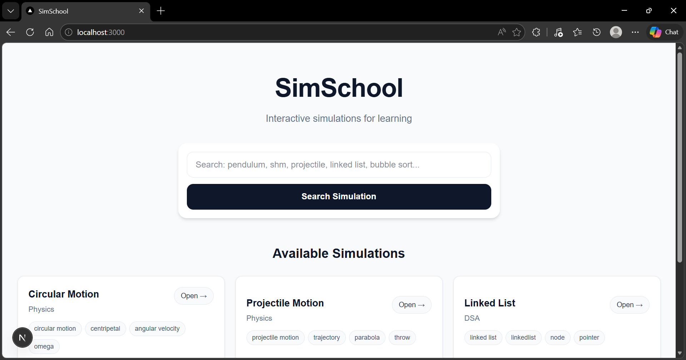
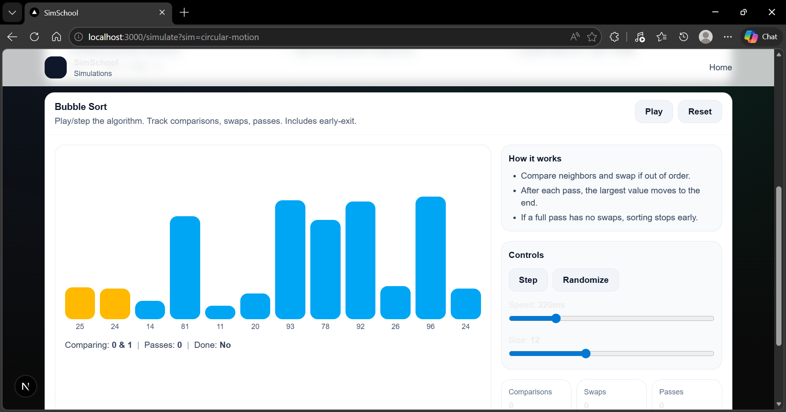
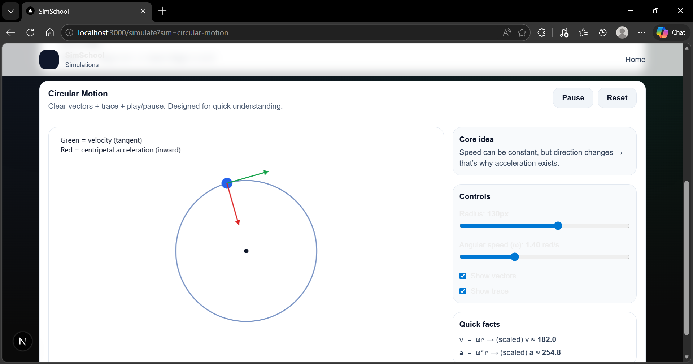
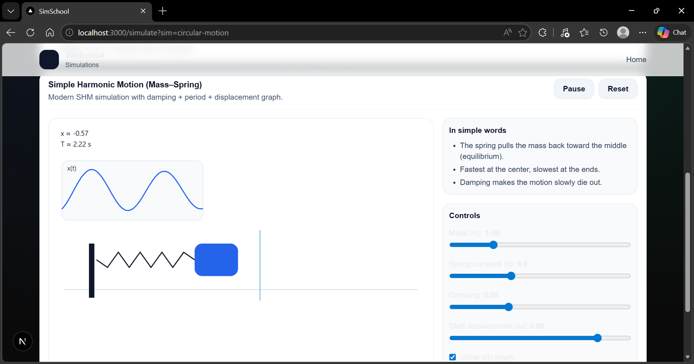

<div align="center">

# 🎓 SimSchool

### Learn complex concepts through interactive, visual simulations

SimSchool is a modern simulation-based learning platform that helps students understand difficult topics through dynamic, intuitive, and hands-on visual experiences.

[](https://simulation-school.vercel.app/)
[](https://github.com/Creative-Adarsh/Simulation-School)


[Live Demo](#-live-demo) •
[Overview](#-overview) •
[Features](#-features) •
[Screenshots](#-screenshots) •
[Architecture](#-architecture) •
[Tech Stack](#%EF%B8%8F-tech-stack) •
[Getting Started](#-getting-started) •
[Roadmap](#-roadmap)

</div>

---



---

## 🌐 Live Demo

> **👉 [https://simulation-school.vercel.app](https://simulation-school.vercel.app/)**

---

## 📖 Overview

SimSchool is built for students and learners who understand better when they can **see a concept working**, **interact with it**, and **experiment with it in real time**.

Rather than relying on static explanations, SimSchool transforms complex subjects into **visual simulation experiences** — making learning more intuitive, memorable, and engaging.

It is especially useful for learners who prefer:

- 🎯 **Visual understanding** over passive reading
- 🔬 **Concept exploration** over memorization
- 🕹️ **Interactive learning** over static theory
- 💡 **Real intuition** over surface-level familiarity

---

## ❓ Why SimSchool?

Traditional learning often explains dynamic ideas using static content — creating a major gap:

| Problem | SimSchool Solution |
|---|---|
| Motion is taught without movement | Real-time physics simulations |
| Algorithms are taught without visualization | Step-by-step animated walkthroughs |
| Systems are explained without interaction | Hands-on, controllable parameters |
| Understanding is expected without exploration | Free exploration and experimentation |

> **SimSchool makes difficult ideas feel understandable.**

---

## ✨ Features

| Feature | Description |
|---|---|
| 🧪 **Interactive Simulations** | Explore concepts visually instead of only reading theory |
| 🔍 **Concept Search** | Search and navigate simulations quickly |
| 📚 **Multi-domain Learning** | Covers Physics and DSA-based topics |
| ⚡ **Modern Web Experience** | Fast, responsive UI powered by Next.js |
| 📱 **Mobile App Foundation** | Expo-powered mobile support for future expansion |
| 📦 **Shared Core Package** | Reusable simulation logic through a monorepo package |
| 🔌 **API Integration** | Route handlers for simulation resolution and backend logic |
| 🗄️ **Supabase Support** | Connected backend utilities and service integration |
| 🤖 **AI-Assisted Logic** | Smart topic-to-simulation resolution pipeline |

---

## 🧪 Current Simulations

SimSchool currently includes interactive modules across **Physics** and **Data Structures & Algorithms**:

### Physics
- 🌀 **Circular Motion** — Rotational dynamics, angular velocity, centripetal force
- 🔁 **Simple Harmonic Motion** — Oscillation, restoring forces, wave patterns
- 🎯 **Projectile Motion** — Trajectory, velocity components, gravity effects
- ⏱️ **Pendulum** — Period, amplitude, gravitational influence

### Data Structures & Algorithms
- 📊 **Bubble Sort** — Step-by-step sorting visualization with comparisons and swaps
- 🔗 **Linked List** — Node connections, insertion, traversal mechanics

---

## 📸 Screenshots

### 🏠 Home Experience


> The landing page lets learners search for topics and instantly access available simulations through a clean, focused interface.

---

### 📊 Bubble Sort Simulation



> A visual and interactive way to understand how sorting works step by step — making algorithm behavior easier to follow.

---

### 🌀 Circular Motion Simulation



> Helps learners understand rotational behavior, angular movement, and related physics concepts through motion-based visualization.

---

### 🔁 Simple Harmonic Motion Simulation



> Helps students intuitively grasp oscillation, restoring forces, and repetitive motion patterns through interactive simulation.

---

## 🏗️ Architecture

SimSchool is structured as a **pnpm monorepo**, allowing multiple applications and shared packages to live in a unified codebase.

```
simschool/
├── apps/
│   ├── api/             # Backend API services
│   ├── mobile/          # Expo / React Native app
│   └── web/             # Next.js web application
├── packages/
│   └── sim-core/        # Shared simulation logic
├── tools/               # Dev utilities & scripts
├── pnpm-workspace.yaml
└── package.json
```

### Project Breakdown

| Package | Description |
|---|---|
| `apps/web` | Main web app — homepage, search, simulation pages, API routes, simulation registry |
| `apps/mobile` | Expo / React Native app — foundation for cross-platform mobile learning |
| `apps/api` | Dedicated backend/API area for service expansion |
| `packages/sim-core` | Shared simulation logic and common abstractions |
| `tools` | Project utilities and development support |

---

### 📂 Web App Structure

```
apps/web/app/
├── api/
│   ├── _lib/
│   │   ├── ai-resolve.ts       # AI topic resolution
│   │   └── supabase-admin.ts   # Supabase admin client
│   ├── db-test/
│   └── resolve-sim/
├── simulate/
│   ├── components/
│   ├── sims/
│   │   ├── bubble-sort.tsx
│   │   ├── circular-motion.tsx
│   │   ├── linked-list.tsx
│   │   ├── pendulum.tsx
│   │   ├── projectile-motion.tsx
│   │   └── simple-harmonic-motion.tsx
│   ├── content.ts
│   ├── sim-registry.ts
│   └── simulate-client.tsx
├── globals.css
├── home-client.tsx
├── layout.tsx
└── page.tsx
```

---

## ⚙️ Tech Stack

| Layer | Technologies |
|---|---|
| **Frontend** | Next.js · React · TypeScript |
| **Mobile** | Expo · React Native |
| **Backend / API** | Next.js Route Handlers |
| **Validation** | Zod |
| **Database / Services** | Supabase |
| **Styling** | Tailwind CSS · PostCSS |
| **Tooling** | pnpm Workspaces · ESLint |

---

## 💡 Design Philosophy

> *If a learner can interact with a concept, they can understand it more deeply.*

This philosophy drives every decision:

- 🧪 **Simulation-first learning** — visuals before text
- 🎨 **Intuitive interfaces** — zero learning curve
- 🚀 **Minimal friction** — search → simulate → understand
- 🎯 **Concept-centered design** — focused on the "aha!" moment

---

## 🚀 Getting Started

### Prerequisites

- **Node.js** 18+
- **pnpm** 10+

```bash
# Install pnpm if needed
npm install -g pnpm
```

### Installation

```bash
# Clone the repository
git clone https://github.com/Creative-Adarsh/Simulation-School.git
cd Simulation-School

# Install all dependencies
pnpm install
```

### Run Locally

```bash
# Web App (opens at http://localhost:3000)
pnpm dev:web

# Mobile App
pnpm dev:mobile

# API Server
pnpm dev:api
```

### Environment Variables

Create a `.env.local` file in `apps/web/`:

```env
SUPABASE_URL=your_supabase_url
SUPABASE_SERVICE_ROLE_KEY=your_service_role_key
AI_API_KEY=your_ai_api_key
```

> ⚠️ **Never commit real secrets into the repository.**

---

## 🌍 Deployment

SimSchool is deployed on **Vercel**.

> **🔗 Live at: [https://simulation-school.vercel.app](https://simulation-school.vercel.app/)**

| Setting | Value |
|---|---|
| Framework | Next.js |
| Root Directory | `apps/web` |
| Package Manager | pnpm |
| Structure | Monorepo |

---

## 🎯 Use Cases

- 🎓 **Students** — Learning difficult topics visually
- 💻 **Beginners** — Understanding algorithm behavior
- 👩‍🏫 **Educators** — Demonstrating concepts interactively
- 📖 **Self-learners** — Building conceptual intuition
- 🏢 **EdTech teams** — Prototyping learning experiences

---

## 🗺️ Roadmap

- [ ] More simulations across subjects (Chemistry, Math, Biology)
- [ ] Improved search and AI-powered topic mapping
- [ ] User profiles and learning progress tracking
- [ ] Richer mobile experience with native interactions
- [ ] Personalized learning paths
- [ ] Analytics and learning insights dashboard
- [ ] Community-contributed simulations

---

## 🤝 Contributing

Contributions, ideas, and improvements are welcome!

```bash
# Create a feature branch
git checkout -b feature/your-feature-name

# Make your changes, then commit
git commit -m "feat: add your feature description"

# Push and open a Pull Request
git push origin feature/your-feature-name
```

---

## 👤 Author

**Adarsh** — [@Creative-Adarsh](https://github.com/Creative-Adarsh)

---

## 📄 License

This project is licensed under the **Apache License 2.0** — see the [LICENSE](./LICENSE) file for details.

---

<div align="center">

**Built to make learning more visual, intuitive, and interactive.** ✨

</div>